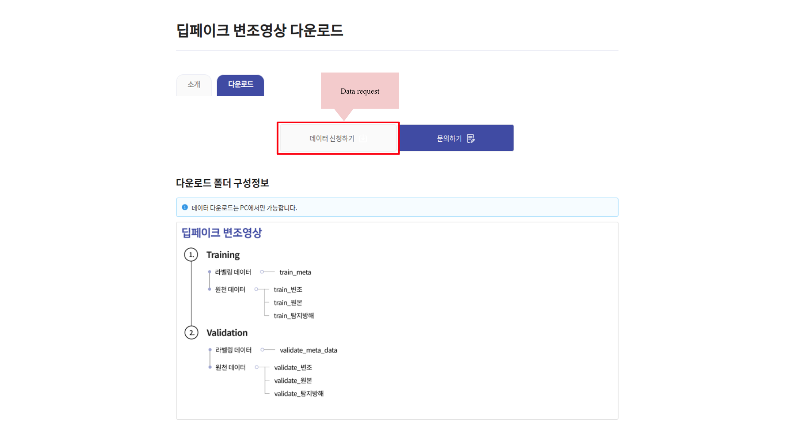
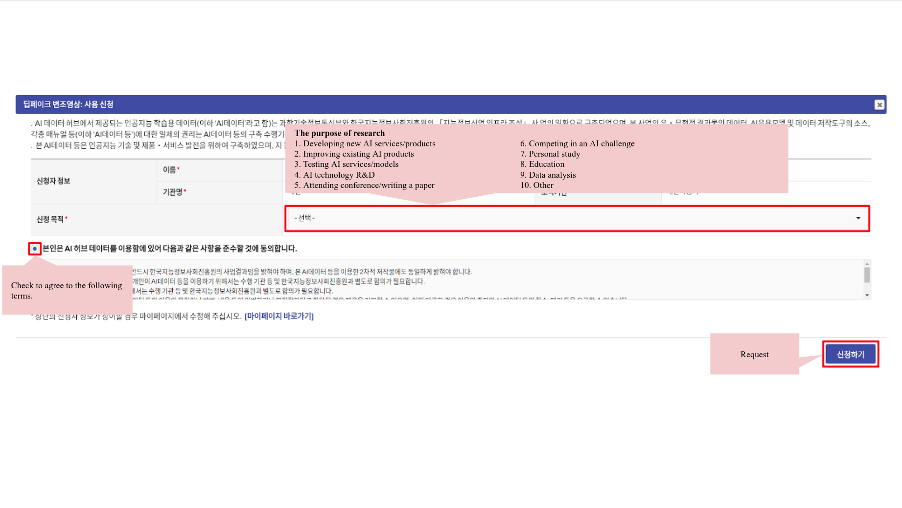

# KoDF

## Abstract 
A variety of effective face-swap and face-reenactment methods have been publicized in recent years, democratizing the face synthesis technology to a great extent. Videos generated as such have come to be collectively called deepfakes with a negative connotation, for various social problems they have caused. Facing the emerging threat of deepfakes, we have built the Korean DeepFake Detection Dataset (KoDF), a large-scale collection of synthesized and real videos focused on Korean subjects. In this paper, we provide a detailed description of methods used to construct the dataset, experimentally show the discrepancy between the distributions of KoDF and existing deepfake detection datasets, and underline the importance of using multiple datasets for real-world generalization. KoDF is publicly available at [https://moneybrain-research.github.io/kodf](https://moneybrain-research.github.io/kodf) in its entirety (i.e. real clips, synthesized clips, clips with additive noise, and their corresponding metadata).

## Download 
This project is supervised by Ministry of Science and ICT (MSIT) and supported by National Information Society Agency (NIA). KoDF can be downloaded via a [designated page](https://aihub.or.kr/aidata/8005) of their assoicated organization, AI Hub.

**Note**: Please inquire [AI Hub](https://aihub.or.kr/contact_info) regarding any registration issues.

<p align="center">
  
</p>

<p align="center">
  
</p>

<p align="center">
  
</p>

<p align="center">
  
</p>

## Citation 

```plain
@misc{kwon2021kodf,
      title={KoDF: A Large-scale Korean DeepFake Detection Dataset},
      author={Patrick Kwon and Jaeseong You and Gyuhyeon Nam and Sungwoo Park and Gyeongsu Chae},
      year={2021},
      eprint={2103.10094},
      archivePrefix={arXiv},
      primaryClass={cs.CV}
}
```
